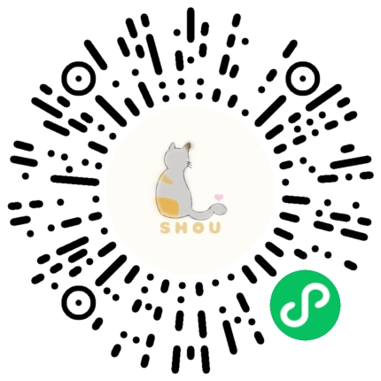

# 流浪猫速查手册 - Cats

> 快速查询附近的流浪猫 帮你找到"梦中情猫"

## 项目依赖

* [dcloudio/uni-app](https://github.com/dcloudio/uni-app)

* [jin-yufeng/Parser](https://github.com/jin-yufeng/Parser)

* [weilanwl/ColorUI](https://github.com/weilanwl/ColorUI)

* [iconfont](https://www.iconfont.cn/)

## 项目背景
[zhiiee](https://github.com/zhiiee/cats)基于北大《燕园猫速查手册》[circle](https://github.com/SCCAPKU/miniprogram)开发了2.0版本，本项目[huobaolajiao](https://github.com/huobaolajiao/cats)基于[zhiiee](https://github.com/zhiiee/cats)走回校园，走进了上海海洋大学SHOU小流浪后援会（动保），持续开发3.0版本，目前已新增1200行代码，根据`GPL-3.0`依法开源

## 功能模块

<!--  -->

## 实现思路

本项目前端采用 [uni-app](https://uniapp.dcloud.io) 框架开发，后端完全采用 [微信小程序云开发](https://developers.weixin.qq.com/miniprogram/dev/wxcloud/basis/getting-started.html) 实现

### 业务流程图

<!--  -->

## 功能演示

腾讯视频：[https://v.qq.com/x/page/w3153x67dxh.html](https://v.qq.com/x/page/w3153x67dxh.html)

## 效果截图

<!-- 

 -->

## 线上版本

<!--  -->
SHOU小流浪图鉴  小程序二维码

## 部署教程

点击 [deployment.md](./deployment.md) 查看部署教程

## 贡献指南

如果有兴趣一起参与开发和维护本项目可以点击 [contributing.md](./contributing.md) 查看贡献指南

## 开源许可

《SHOU小流浪图鉴》的源代码基于 `GPL-3.0` 协议全网开源，可用于商业用途，如果您使用了《流浪猫速查手册》的源代码，那么您的项目必须遵守 `GPL-3.0` 协议进行全网开源，点击 [LICENSE](./LICENSE) 查看许可协议
